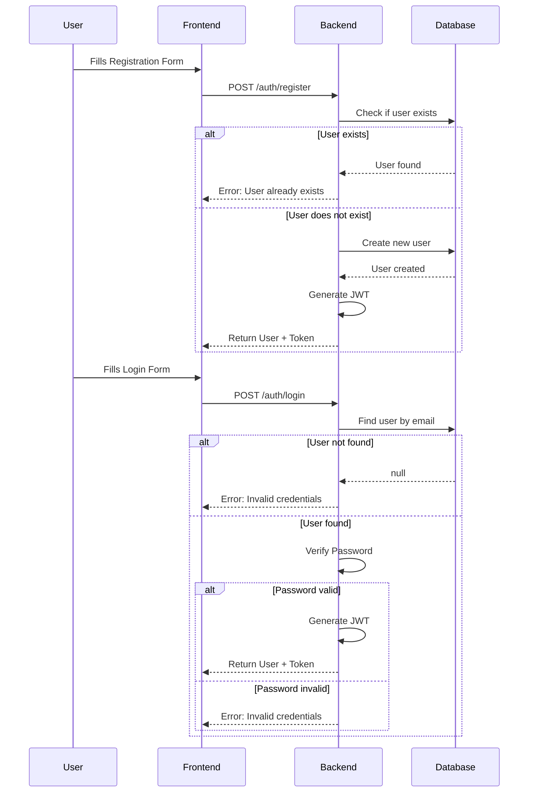
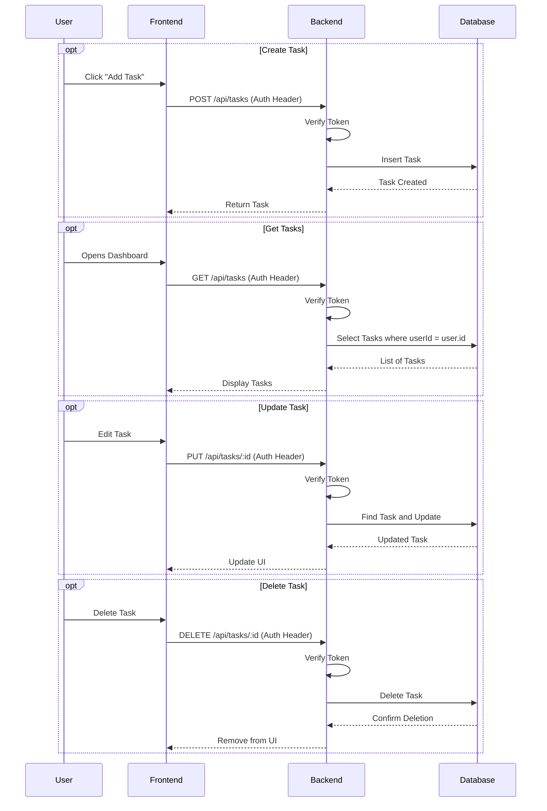

# Task Management Application

MERN stack application with PostgreSQL database.

## Features
- User authentication (JWT)
- Task CRUD operations
- Dashboard with Chart.js statistics
- PostgreSQL database with Sequelize ORM

## Application Flows

### Authentication Flow

### Task Management Flow

## Live Demo
- Frontend: 

- Backend API: 

The backend is built with Node.js and Express, providing a RESTful API for secure user authentication and task management. It utilizes Sequelize ORM to interact with the PostgreSQL database.

## Local Development
[Your local setup instructions]
add env 
    PORT=5000
    NODE_ENV=development
    JWT_SECRET=your_jwt_secret
    DB_NAME=your_db_name
    DB_USER=your_db_user
    DB_PASSWORD=your_db_password
    DB_HOST=localhost
    DB_PORT=5432
    SUPABASE_URL=your_supabase_connection_string

    deployed url : https://task-ntgu.onrender.com

